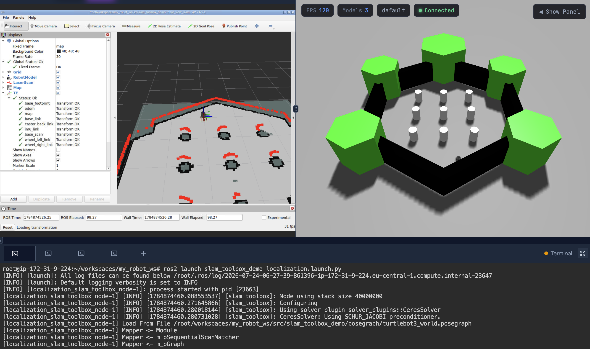

# slam-mapping-localization-Mahmoud-Hassan

## 1. Task Overview

This project demonstrates the full SLAM Toolbox workflow on a two-wheeled TurtleBot3 robot equipped with a LiDAR, operating inside the `turtlebot3_world` Gazebo environment.

**Goal:** Build a live map of `turtlebot3_world` using SLAM Toolbox and keyboard teleop, then build a localization mode where the robot has to find its own pose inside that mapped world.

The task is split into two phases:

| Phase | What it does | Think of it as |
|---|---|---|
| **Step 1 — Mapping** | Launch `turtlebot3_world`, run SLAM Toolbox in mapping mode, drive the robot with keyboard teleop, watch the occupancy grid grow live in RViz, save the finished map (`.yaml` + `.pgm`), and serialize the pose graph for later reuse | The process of understanding how the world looks |
| **Step 2 — Localization** | Launch SLAM Toolbox in localization mode using the saved pose graph, give the robot a deliberately **wrong** 2D Pose Estimate to observe the mismatch, then correct it with an **accurate** 2D Pose Estimate to confirm alignment, and drive around to confirm the map stays fixed while only the robot pose updates | The process of understanding where the robot is on the map |

---

## 2. Step-by-Step Instructions

### Step 1 — Mapping

**What it does:**
- Launch `turtlebot3_world` in Gazebo — this spawns the two-wheeled robot with LiDAR inside the environment
- Run SLAM Toolbox in async mapping mode
- Drive the robot using keyboard teleop to explore and map the world
- Confirm `/scan` and `/odom` are publishing
- Watch the occupancy grid grow live in RViz (Fixed Frame set to `map`, with `RobotModel`, `LaserScan`, `Map`, and `TF` displays enabled)
- Once the map is complete, save it with `map_saver_cli` (`.yaml` + `.pgm`)
- Serialize the pose graph so it can be reloaded for localization

**Commands:**

```bash
# 1. Place the slam_toolbox_demo package inside your workspace src folder
cp -r slam_toolbox_demo ~/workspaces/UR_WORKSPACE/src/

# 2. Build the package
cd ~/workspaces/UR_WORKSPACE/
colcon build --packages-select slam_toolbox_demo
source install/setup.bash

# 3. Launch mapping mode
ros2 launch slam_toolbox_demo slam_toolbox_online_async.launch.py
```

Open RViz in a second terminal and add the following displays: **RobotModel**, **LaserScan**, **Map**, **TF**, with the **Fixed Frame** set to `map`.

```bash
rviz2
```

Drive the robot around the full `turtlebot3_world` environment using keyboard teleop until the occupancy grid map is fully generated (no unexplored/unknown areas left that matter for localization).

**Do not close the mapping launch file yet** — save the map and pose graph first:

```bash
# 4. Save the occupancy grid map (.pgm + .yaml)
cd ~/workspaces/UR_WORKSPACE/src/slam_toolbox_demo/map
ros2 run nav2_map_server map_saver_cli -f turtlebot3_world_map
```

> The `.pgm` file can be visually inspected using a PGM viewer extension inside VS Code.

```bash
# 5. Serialize the pose graph for localization (run in a NEW terminal, keep mapping node alive)
ros2 service call /slam_toolbox/serialize_map slam_toolbox/srv/SerializePoseGraph \
  "{filename: '/root/workspaces/UR_WS_NAME/src/slam_toolbox_demo/posegraph/turtlebot3_world'}"
```

This produces:
```
turtlebot3_world.posegraph
turtlebot3_world.data
```

**Verify the files saved correctly** — sizes should be in the tens of KB, not bytes (a byte-sized `.data` file indicates an empty/degenerate map and will cause the localization node to crash):

```bash
ls -la src/slam_toolbox_demo/posegraph/
```

Only after confirming both files are populated correctly should the mapping launch file be closed.

---

### Step 2 — Localization

**What it does:**
- Launch SLAM Toolbox in localization mode using the saved pose graph
- In RViz, first give the robot a deliberately **wrong** 2D Pose Estimate
- Observe the mismatch between the live laser scan and the saved map
- Then correct it with an **accurate** 2D Pose Estimate and confirm alignment
- Drive around and confirm the map stays fixed — only the robot pose updates

**Commands:**

```bash
cd ~/workspaces/UR_WORKSPACE/
source install/setup.bash
ros2 launch slam_toolbox_demo localization.launch.py
```

This loads the previously saved occupancy grid map and serialized pose graph. Move the robot inside Gazebo using the built-in simulation controls.

The initial pose is already set inside `slam_toolbox_localization.yaml` via:

```yaml
map_start_pose: [0.0, 0.0, 0.0]
```

which coincides with the map's reference frame origin.

**Testing pose mismatch:**

In RViz, use the **2D Pose Estimate** tool from the toolbar:

1. Click **2D Pose Estimate** and point at a location/orientation **different** from the robot's actual pose in the simulation — this is the deliberately wrong estimate.
2. Observe the mismatch between the live `LaserScan` and the static `Map` display — the scan will not align with the map's walls/obstacles.
3. Click **2D Pose Estimate** again, this time pointing at the robot's **actual** location and heading — this is the correct estimate.
4. Observe the scan snap into alignment with the map.
5. Drive the robot around and confirm the map stays fixed in place while only the robot's TF pose updates.


---

## 3. Expected Output

### `/odom` topic echo

```bash
ros2 topic echo /odom --once
```

```yaml
header:
  stamp:
    sec: 2460
    nanosec: 740000000
  frame_id: odom
child_frame_id: base_footprint
pose:
  pose:
    position:
      x: 9.600784698976675e-09
      y: -2.214038724155113e-21
      z: 0.0
    orientation:
      x: 0.0
      y: 0.0
      z: -2.304401267524048e-13
      w: 1.0
  covariance: [all 36 values are zero]
twist:
  twist:
    linear:
      x: -9.85172109550656e-20
      y: 0.0
      z: 0.0
    angular:
      x: 0.0
      y: 0.0
      z: -3.567216391634932e-19
  covariance: [all 36 values are zero]
```

This confirms `/odom` is publishing valid, near-zero pose/twist values consistent with the robot sitting at the map origin at the start of localization.

### TF Tree

The TF tree must show the full chain: **`map` → `odom` → `base_footprint` → `base_link`**.



The screenshot above shows RViz with `Fixed Frame` set to `map`, all TF transforms reporting `Transform OK` (`base_footprint`, `odom`, `map`, `base_link`, `caster_back_link`, `imu_link`, `base_scan`, `wheel_left_link`, `wheel_right_link`), alongside the Gazebo simulation view and the localization launch terminal output showing the pose graph being loaded from `/root/workspaces/my_robot_ws/src/slam_toolbox_demo/posegraph/turtlebot3_world.posegraph`.

---
#### Reported Observations for wrong and correct initial pose

**Wrong initial pose:**
The laser scan points did not overlap with the map's wall boundaries; the scan appeared rotated/offset relative to the map geometry, indicating the estimated pose did not match the robot's true location.

**Correct initial pose:**
After re-estimating the pose at the robot's true location and heading, the laser scan snapped into alignment with the map walls and obstacles, confirming correct localization.

## 4. Demo


---

## 5. Package Structure

```
slam-mapping-localization-[YOUR-NAME]/
└── slam_toolbox_demo/
    ├── config/        (mapping + localization yaml)
    ├── launch/        (mapping + localization launch files)
    ├── map/           (turtlebot3_world_map.yaml / .pgm)
    ├── posegraph/     (.posegraph + .data)
    ├── CMakeLists.txt
    ├── package.xml
    └── README.md
```

---

## 6. Submission Checklist

- [ ] Repository is **PUBLIC**
- [ ] Map saved: `turtlebot3_world_map.yaml` + `.pgm` included
- [ ] Pose graph saved: `.posegraph` + `.data` included (sizes in tens of KB, not bytes)
- [ ] Mapping launch file and config work without errors
- [ ] Localization launch file and config work without errors
- [ ] Screenshot + reported observations of the wrong initial pose in RViz
- [ ] Screenshot + reported observations of the correct initial pose in RViz
- [ ] TF tree screenshot showing `map → odom → base_footprint → base_link`
- [ ] Terminal output of `/odom` echo included in README (above)
- [ ] Built cleanly with `colcon build` and no errors
